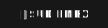

  <h1 align="center">
    Hey there!👋
     
    I'm Mahatab Hossen Sudip
  </h1>

## 👋 About Me

Hey there! I'm **Mahatab Hossen Sudip**, but you can call me **Sudip** 😊  
I'm a **Front-End Focused MERN Stack Web Developer** who loves building clean, fast, and modern web apps using **JavaScript** technologies.

- 🧠 Always learning new things & improving my skills
- 🔥 Passionate about creating smooth, user-friendly interfaces
- 🛠️ Currently working with: `React.js`, `Next.js`, `TailwindCSS`
- 💬 Ask me anything about: `JavaScript`, `HTML`, `CSS`, `React.js`
- 🧑‍🎓 Diving deeper into: `Express.js`, `Node.js`, `TypeScript`
- 🎯 Goal: Make things simple, useful, and beautiful

## 🛠 My Toolbox

### 🚀 Front-End

  
  
  
  
  
  
  
  
   
  
   
  
  
  
  
  

### 🧩 Back-End & Databases

  
  
  
  
  

### 🧰 Tools & Platforms

  
  
  
  
  
  

### 🔐 Security

  
  
  

## 📈 GitHub Stats

  
  

## 🔥 Streak Status

  

## 📬 Let's Connect

  
  
  
  
  <!-- -->

  

   
  ⭐️ From <a href="https://github.com/SudipMHX">SudipMHX</a>

